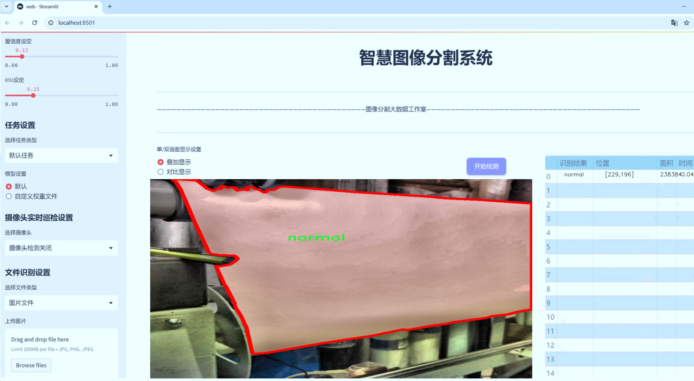
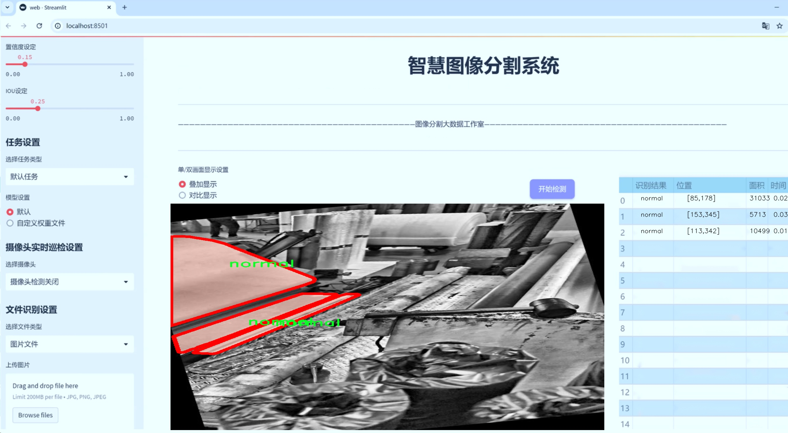
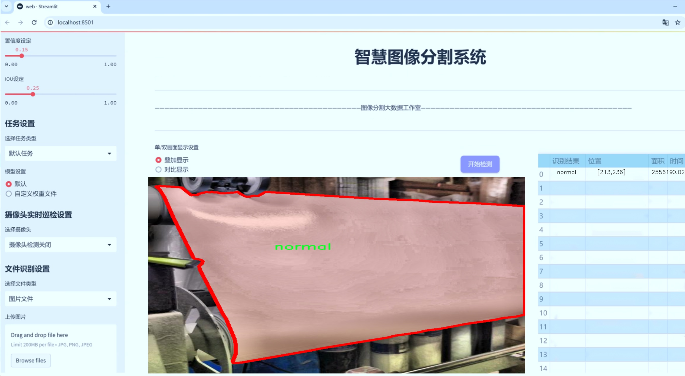
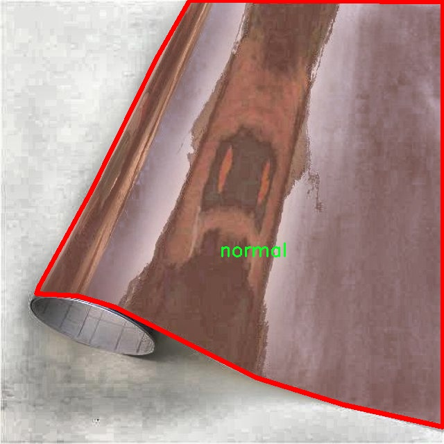
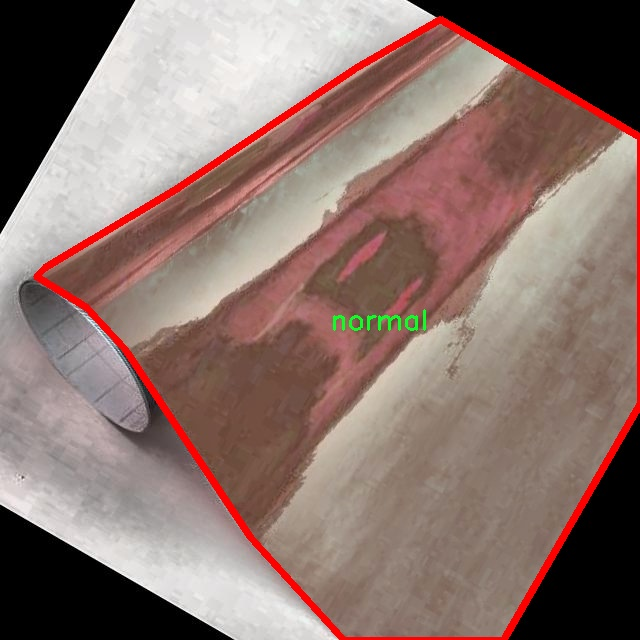
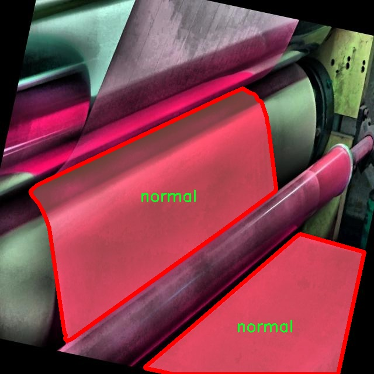
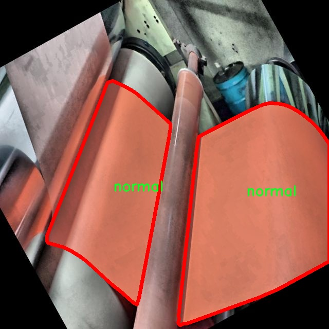
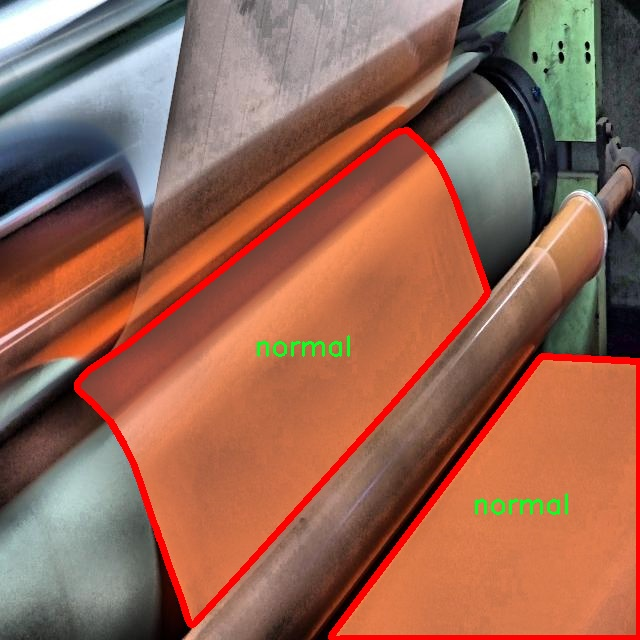

# 纸张生产线缺陷识别图像分割系统： yolov8-seg-RCSOSA

### 1.研究背景与意义

[参考博客](https://gitee.com/YOLOv8_YOLOv11_Segmentation_Studio/projects)

[博客来源](https://kdocs.cn/l/cszuIiCKVNis)

研究背景与意义

随着工业自动化的不断发展，生产线的智能化程度逐渐提高，尤其是在纸张生产领域，如何提高产品质量、降低生产成本成为了企业面临的重要挑战。纸张作为一种广泛应用于各个行业的基础材料，其生产过程中的缺陷识别与控制直接影响到最终产品的质量和市场竞争力。因此，开发高效的缺陷识别系统对于提升纸张生产线的自动化水平、降低人工成本、提高生产效率具有重要的现实意义。

近年来，深度学习技术的迅猛发展为图像处理领域带来了革命性的变化，尤其是目标检测与图像分割技术的进步，使得缺陷识别的准确性和效率得到了显著提升。YOLO（You Only Look Once）系列模型因其快速的推理速度和较高的检测精度，已成为实时目标检测任务中的重要工具。YOLOv8作为该系列的最新版本，结合了更为先进的网络结构和训练策略，展现出了优越的性能。然而，针对特定行业的应用，尤其是纸张生产线的缺陷识别，仍然存在一定的挑战，主要体现在对复杂背景下细微缺陷的检测能力不足。

在此背景下，基于改进YOLOv8的纸张生产线缺陷识别图像分割系统的研究显得尤为重要。本研究旨在通过对YOLOv8模型进行改进，结合纸张生产过程中的实际需求，设计出一套高效的缺陷识别与图像分割系统。该系统将基于"SheetEye_Seg_normal_defect"数据集进行训练，该数据集包含2000张图像，涵盖正常纸张与缺陷纸张两大类，能够为模型的训练提供丰富的样本支持。通过对该数据集的深入分析与处理，我们可以提取出纸张缺陷的特征信息，从而提高模型对不同类型缺陷的识别能力。

本研究的意义不仅在于技术层面的创新，更在于其对纸张生产行业的实际应用价值。通过引入改进的YOLOv8模型，我们期望能够实现对纸张生产线的实时监控与缺陷检测，降低人工检验的工作量，提高缺陷识别的准确性和效率。此外，研究成果将为后续的智能制造与工业4.0的实现提供理论支持与技术参考，推动纸张生产行业向更高水平的智能化发展。

综上所述，基于改进YOLOv8的纸张生产线缺陷识别图像分割系统的研究，具有重要的学术价值与实际应用意义。它不仅为深度学习在工业领域的应用提供了新的思路，也为纸张生产企业在提升产品质量、降低生产成本方面提供了切实可行的解决方案。通过本研究的深入开展，我们期待能够为纸张生产线的智能化升级贡献一份力量。

### 2.图片演示







注意：本项目提供完整的训练源码数据集和训练教程,由于此博客编辑较早,暂不提供权重文件（best.pt）,需要按照6.训练教程进行训练后实现上图效果。

### 3.视频演示

[3.1 视频演示](https://www.bilibili.com/video/BV1T9zSYtEfQ/)

### 4.数据集信息

##### 4.1 数据集类别数＆类别名

nc: 2
names: ['defect', 'normal']


##### 4.2 数据集信息简介

数据集信息展示

在纸张生产线的质量控制中，缺陷识别是一个至关重要的环节。为了提升这一过程的自动化水平和准确性，构建了一个名为“SheetEye_Seg_normal_defect”的数据集，专门用于训练改进YOLOv8-seg的图像分割系统。该数据集旨在通过深度学习技术，准确识别和分割纸张生产过程中出现的缺陷，进而实现高效的质量监控和缺陷管理。

“SheetEye_Seg_normal_defect”数据集包含了两类图像，分别为“defect”和“normal”。其中，“defect”类图像展示了在纸张生产过程中可能出现的各种缺陷，例如污点、划痕、色差等，这些缺陷可能会影响纸张的外观和使用性能。而“normal”类图像则代表了符合质量标准的正常纸张，这些图像为模型提供了一个基准，以便于在训练过程中进行有效的对比和学习。

该数据集的构建过程经过精心设计，确保了图像的多样性和代表性。所有图像均来自实际的纸张生产线，涵盖了不同的生产批次和条件，反映了真实环境中的各种可能性。这种多样性不仅增强了模型的泛化能力，还使其能够适应不同类型的纸张和生产工艺，从而提高了缺陷识别的准确性。

在数据集的标注过程中，采用了先进的图像分割技术，对每一张图像中的缺陷区域进行了精确的标注。这一过程不仅要求标注人员具备专业的知识和经验，还需要对每种缺陷的特征有深入的理解。通过这种细致的标注，数据集为模型提供了丰富的训练样本，使其能够学习到缺陷的形状、大小、位置等特征，从而在实际应用中实现高效的缺陷检测。

在模型训练阶段，改进YOLOv8-seg算法将充分利用“SheetEye_Seg_normal_defect”数据集的特性，通过深度学习技术不断优化其参数，以实现对纸张缺陷的高效识别和分割。YOLOv8-seg作为一种先进的目标检测和分割算法，具备实时处理的能力，能够在生产线上快速识别出缺陷，极大地提高了生产效率和产品质量。

此外，数据集的设计还考虑到了未来的扩展性。随着生产技术的不断进步和市场需求的变化，可能会出现新的缺陷类型或新的纸张产品。因此，数据集的构建者留有一定的余地，以便于后续对数据集进行更新和扩展。这种灵活性不仅能够满足当前的需求，还为未来的研究和应用提供了可能性。

总之，“SheetEye_Seg_normal_defect”数据集的构建为纸张生产线的缺陷识别提供了坚实的基础。通过结合深度学习技术，尤其是改进YOLOv8-seg算法，该数据集将推动纸张生产领域的智能化进程，助力企业实现更高效的质量控制和管理。











### 5.项目依赖环境部署教程（零基础手把手教学）

[5.1 环境部署教程链接（零基础手把手教学）](https://www.bilibili.com/video/BV1jG4Ve4E9t/?vd_source=bc9aec86d164b67a7004b996143742dc)


[5.2 安装Python虚拟环境创建和依赖库安装视频教程链接（零基础手把手教学）](https://www.bilibili.com/video/BV1nA4VeYEze/?vd_source=bc9aec86d164b67a7004b996143742dc)

### 6.手把手YOLOV8-seg训练视频教程（零基础手把手教学）

[6.1 手把手YOLOV8-seg训练视频教程（零基础小白有手就能学会）](https://www.bilibili.com/video/BV1cA4VeYETe/?vd_source=bc9aec86d164b67a7004b996143742dc)


按照上面的训练视频教程链接加载项目提供的数据集，运行train.py即可开始训练



     Epoch   gpu_mem       box       obj       cls    labels  img_size
     1/200     0G   0.01576   0.01955  0.007536        22      1280: 100%|██████████| 849/849 [14:42<00:00,  1.04s/it]
               Class     Images     Labels          P          R     mAP@.5 mAP@.5:.95: 100%|██████████| 213/213 [01:14<00:00,  2.87it/s]
                 all       3395      17314      0.994      0.957      0.0957      0.0843

     Epoch   gpu_mem       box       obj       cls    labels  img_size
     2/200     0G   0.01578   0.01923  0.007006        22      1280: 100%|██████████| 849/849 [14:44<00:00,  1.04s/it]
               Class     Images     Labels          P          R     mAP@.5 mAP@.5:.95: 100%|██████████| 213/213 [01:12<00:00,  2.95it/s]
                 all       3395      17314      0.996      0.956      0.0957      0.0845

     Epoch   gpu_mem       box       obj       cls    labels  img_size
     3/200     0G   0.01561    0.0191  0.006895        27      1280: 100%|██████████| 849/849 [10:56<00:00,  1.29it/s]
               Class     Images     Labels          P          R     mAP@.5 mAP@.5:.95: 100%|███████   | 187/213 [00:52<00:00,  4.04it/s]
                 all       3395      17314      0.996      0.957      0.0957      0.0845


### 7.50+种全套YOLOV8-seg创新点加载调参实验视频教程（一键加载写好的改进模型的配置文件）

[7.1 50+种全套YOLOV8-seg创新点加载调参实验视频教程（一键加载写好的改进模型的配置文件）](https://www.bilibili.com/video/BV1Hw4VePEXv/?vd_source=bc9aec86d164b67a7004b996143742dc)

### YOLOV8-seg算法简介

原始YOLOv8-seg算法原理

YOLOv8-seg算法是Ultralytics公司在2023年推出的YOLO系列中的一个重要版本，它在YOLOv7的基础上进行了多方面的改进和优化，特别是在目标检测和分割任务上展现了卓越的性能。YOLOv8-seg不仅继承了YOLO系列一贯的高效性和准确性，还引入了更深层次的卷积神经网络结构，使得算法在处理复杂场景时能够更好地捕捉细节信息。

该算法的核心在于其网络结构的设计，YOLOv8-seg将整个图像作为输入，通过一系列卷积层和反卷积层直接进行目标检测和分割，而不需要依赖传统的滑动窗口或区域提议方法。这种设计极大地提高了检测的速度和精度，尤其是在实时应用场景中，如智能监控和自动驾驶等领域。YOLOv8-seg采用了多尺度训练和测试策略，结合特征金字塔网络（FPN），使得算法能够在不同尺度上有效地提取特征，从而提升了对小目标和复杂背景的识别能力。

在YOLOv8-seg的网络结构中，主要分为三个部分：Backbone、Neck和Head。Backbone部分负责特征提取，采用了一系列卷积和反卷积层，通过残差连接和瓶颈结构来优化网络的性能。具体而言，YOLOv8-seg引入了C2模块作为基本构成单元，利用其独特的结构设计，使得网络在保持较小参数量的同时，能够有效地捕捉到丰富的特征信息。

Neck部分则采用了多尺度特征融合技术，将来自Backbone不同阶段的特征图进行融合，以便更好地捕捉不同尺度目标的信息。这一设计不仅提高了目标检测的性能，还增强了算法的鲁棒性，使其在面对复杂场景时依然能够保持高效的检测能力。

Head部分是YOLOv8-seg的关键，它负责最终的目标检测和分割任务。该部分设有多个检测头，能够在不同尺寸的信息下进行目标的检测和分割。通过并行的分支结构，YOLOv8-seg能够分别提取类别和位置特征，从而提高了模型的收敛速度和预测精度。这种解耦头的设计理念，使得分类任务和定位任务能够更好地协同工作，进一步提升了整体性能。

值得注意的是，YOLOv8-seg在模型训练过程中，特别关注数据增强技术的使用。尽管Mosaic数据增强在提升模型鲁棒性和泛化性方面发挥了重要作用，但YOLOv8-seg在训练的最后阶段停止使用该技术，以避免对数据真实分布的干扰。这一策略的实施，使得模型能够更好地学习到真实场景中的特征，从而提升了检测和分割的准确性。

此外，YOLOv8-seg还引入了无锚框结构，直接预测目标的中心位置，并通过任务对齐学习（Task Alignment Learning）来优化正负样本的区分。这一创新性的设计，结合了分类分数和IOU的高次幂乘积，作为衡量任务对齐程度的指标，确保了在分类和定位损失函数中同时兼顾了定位和分类的评价标准。

在性能方面，YOLOv8-seg在多个标准数据集上表现出色，尤其是在COCO数据集上，模型的mAP（mean Average Precision）指标达到了新的高度。这一成就不仅证明了YOLOv8-seg在目标检测和分割任务中的有效性，也为其在实际应用中的推广奠定了基础。

综上所述，YOLOv8-seg算法通过一系列创新的设计和优化，不仅提升了目标检测和分割的精度和速度，还在处理复杂场景时展现了卓越的鲁棒性。这使得YOLOv8-seg成为当前目标检测领域中的一项重要技术，具备广泛的应用前景。随着研究的深入和技术的不断进步，YOLOv8-seg无疑将在未来的智能视觉系统中发挥更加重要的作用。


### 9.系统功能展示（检测对象为举例，实际内容以本项目数据集为准）

图9.1.系统支持检测结果表格显示

  图9.2.系统支持置信度和IOU阈值手动调节

  图9.3.系统支持自定义加载权重文件best.pt(需要你通过步骤5中训练获得)

  图9.4.系统支持摄像头实时识别

  图9.5.系统支持图片识别

  图9.6.系统支持视频识别

  图9.7.系统支持识别结果文件自动保存

  图9.8.系统支持Excel导出检测结果数据


### 10.50+种全套YOLOV8-seg创新点原理讲解（非科班也可以轻松写刊发刊，V11版本正在科研待更新）

#### 10.1 由于篇幅限制，每个创新点的具体原理讲解就不一一展开，具体见下列网址中的创新点对应子项目的技术原理博客网址【Blog】：


[10.1 50+种全套YOLOV8-seg创新点原理讲解链接](https://gitee.com/qunmasj/good)

#### 10.2 部分改进模块原理讲解(完整的改进原理见上图和技术博客链接)【如果此小节的图加载失败可以通过CSDN或者Github搜索该博客的标题访问原始博客，原始博客图片显示正常】

### Gold-YOLO


#### Preliminaries
YOLO系列的中间层结构采用了传统的FPN结构，其中包含多个分支用于多尺度特征融合。然而，它只充分融合来自相邻级别的特征，对于其他层次的信息只能间接地进行“递归”获取。

传统的FPN结构在信息传输过程中存在丢失大量信息的问题。这是因为层之间的信息交互仅限于中间层选择的信息，未被选择的信息在传输过程中被丢弃。这种情况导致某个Level的信息只能充分辅助相邻层，而对其他全局层的帮助较弱。因此，整体上信息融合的有效性可能受到限制。
为了避免在传输过程中丢失信息，本文采用了一种新颖的“聚集和分发”机制（GD），放弃了原始的递归方法。该机制使用一个统一的模块来收集和融合所有Level的信息，并将其分发到不同的Level。通过这种方式，作者不仅避免了传统FPN结构固有的信息丢失问题，还增强了中间层的部分信息融合能力，而且并没有显著增加延迟。


#### 低阶聚合和分发分支 Low-stage gather-and-distribute branch
从主干网络中选择输出的B2、B3、B4、B5特征进行融合，以获取保留小目标信息的高分辨率特征。


#### 高阶聚合和分发分支 High-stage gather-and-distribute branch
高级全局特征对齐模块（High-GD）将由低级全局特征对齐模块（Low-GD）生成的特征{P3, P4, P5}进行融合。


Transformer融合模块由多个堆叠的transformer组成，transformer块的数量为L。每个transformer块包括一个多头注意力块、一个前馈网络（FFN）和残差连接。采用与LeViT相同的设置来配置多头注意力块，使用16个通道作为键K和查询Q的头维度，32个通道作为值V的头维度。为了加速推理过程，将层归一化操作替换为批归一化，并将所有的GELU激活函数替换为ReLU。为了增强变换器块的局部连接，在两个1x1卷积层之间添加了一个深度卷积层。同时，将FFN的扩展因子设置为2，以在速度和计算成本之间取得平衡。


信息注入模块(Information injection module)： 高级全局特征对齐模块（High-GD）中的信息注入模块与低级全局特征对齐模块（Low-GD）中的相同。在高级阶段，局部特征（Flocal）等于Pi，因此公式如下所示：


#### 增强的跨层信息流动 Enhanced cross-layer information flow
为了进一步提升性能，从YOLOv6 中的PAFPN模块中得到启发，引入了Inject-LAF模块。该模块是注入模块的增强版，包括了一个轻量级相邻层融合（LAF）模块，该模块被添加到注入模块的输入位置。为了在速度和准确性之间取得平衡，设计了两个LAF模型：LAF低级模型和LAF高级模型，分别用于低级注入（合并相邻两层的特征）和高级注入（合并相邻一层的特征）。它们的结构如图5(b)所示。为了确保来自不同层级的特征图与目标大小对齐，在实现中的两个LAF模型仅使用了三个操作符：双线性插值（上采样过小的特征）、平均池化（下采样过大的特征）和1x1卷积（调整与目标通道不同的特征）。模型中的LAF模块与信息注入模块的结合有效地平衡了准确性和速度之间的关系。通过使用简化的操作，能够增加不同层级之间的信息流路径数量，从而提高性能而不显著增加延迟。


### 11.项目核心源码讲解（再也不用担心看不懂代码逻辑）

#### 11.1 ultralytics\models\nas\__init__.py

以下是对给定代码的逐文件分析和核心部分的保留，同时进行了详细的中文注释：

```python
# Ultralytics YOLO 🚀, AGPL-3.0 license

# 从当前包中导入 NAS 模型类
from .model import NAS

# 从当前包中导入 NAS 预测器类
from .predict import NASPredictor

# 从当前包中导入 NAS 验证器类
from .val import NASValidator

# 定义当前模块的公共接口，包含 NASPredictor、NASValidator 和 NAS 类
__all__ = 'NASPredictor', 'NASValidator', 'NAS'
```

### 代码分析与注释

1. **模块导入**：
   - `from .model import NAS`：从当前包（即包含该代码的目录）中导入 `NAS` 类，`NAS` 可能是一个深度学习模型的实现。
   - `from .predict import NASPredictor`：导入 `NASPredictor` 类，负责使用 `NAS` 模型进行预测。
   - `from .val import NASValidator`：导入 `NASValidator` 类，负责验证 `NAS` 模型的性能。

2. **公共接口定义**：
   - `__all__ = 'NASPredictor', 'NASValidator', 'NAS'`：定义了模块的公共接口，指定了当使用 `from module import *` 时，哪些名称是可以被导入的。这有助于控制模块的可见性，避免不必要的名称冲突。

### 核心部分总结
该代码主要用于模块的组织和接口的定义，确保了模型、预测器和验证器可以被外部使用，同时隐藏了内部实现细节。

这个文件是Ultralytics YOLO项目中的一个初始化文件，通常用于定义模块的公共接口。在这个文件中，首先通过注释说明了该项目的名称和许可证类型（AGPL-3.0）。接下来，文件从同一目录下导入了三个类：`NAS`、`NASPredictor`和`NASValidator`。这些类分别代表了模型、预测器和验证器的功能。

最后，`__all__`变量被定义为一个元组，包含了三个导入的类名。这意味着当使用`from ultralytics.models.nas import *`这样的语句时，只会导入`NASPredictor`、`NASValidator`和`NAS`这三个类。这种做法有助于控制模块的公共接口，确保只有特定的类和函数可以被外部访问，从而提高了代码的封装性和可维护性。总的来说，这个文件在项目中起到了组织和简化模块接口的作用。

#### 11.2 ultralytics\models\yolo\segment\train.py

以下是经过简化和注释的核心代码部分：

```python
# 导入必要的库和模块
from copy import copy
from ultralytics.models import yolo
from ultralytics.nn.tasks import SegmentationModel
from ultralytics.utils import DEFAULT_CFG, RANK
from ultralytics.utils.plotting import plot_images, plot_results

class SegmentationTrainer(yolo.detect.DetectionTrainer):
    """
    扩展DetectionTrainer类，用于基于分割模型的训练。
    示例用法：
        args = dict(model='yolov8n-seg.pt', data='coco8-seg.yaml', epochs=3)
        trainer = SegmentationTrainer(overrides=args)
        trainer.train()
    """

    def __init__(self, cfg=DEFAULT_CFG, overrides=None, _callbacks=None):
        """初始化SegmentationTrainer对象，接受配置和覆盖参数。"""
        if overrides is None:
            overrides = {}
        overrides['task'] = 'segment'  # 设置任务类型为分割
        super().__init__(cfg, overrides, _callbacks)  # 调用父类构造函数

    def get_model(self, cfg=None, weights=None, verbose=True):
        """返回初始化的SegmentationModel，使用指定的配置和权重。"""
        # 创建SegmentationModel实例，通道数为3，类别数为数据集中类别数量
        model = SegmentationModel(cfg, ch=3, nc=self.data['nc'], verbose=verbose and RANK == -1)
        if weights:
            model.load(weights)  # 如果提供了权重，则加载权重

        return model  # 返回模型实例

    def get_validator(self):
        """返回SegmentationValidator实例，用于YOLO模型的验证。"""
        self.loss_names = 'box_loss', 'seg_loss', 'cls_loss', 'dfl_loss'  # 定义损失名称
        # 创建并返回SegmentationValidator实例
        return yolo.segment.SegmentationValidator(self.test_loader, save_dir=self.save_dir, args=copy(self.args))

    def plot_training_samples(self, batch, ni):
        """创建训练样本图像的绘图，包括标签和框坐标。"""
        plot_images(batch['img'],  # 图像数据
                    batch['batch_idx'],  # 批次索引
                    batch['cls'].squeeze(-1),  # 类别标签
                    batch['bboxes'],  # 边界框
                    batch['masks'],  # 掩码
                    paths=batch['im_file'],  # 图像文件路径
                    fname=self.save_dir / f'train_batch{ni}.jpg',  # 保存路径
                    on_plot=self.on_plot)  # 绘图回调

    def plot_metrics(self):
        """绘制训练和验证指标。"""
        plot_results(file=self.csv, segment=True, on_plot=self.on_plot)  # 保存结果图像
```

### 代码注释说明：
1. **导入部分**：导入所需的库和模块，主要用于模型构建、数据处理和绘图。
2. **SegmentationTrainer类**：继承自DetectionTrainer类，专门用于分割任务的训练。
3. **构造函数**：初始化时设置任务类型为分割，并调用父类的构造函数。
4. **get_model方法**：创建并返回一个SegmentationModel实例，支持加载预训练权重。
5. **get_validator方法**：返回一个SegmentationValidator实例，用于模型验证，定义了损失名称。
6. **plot_training_samples方法**：绘制训练样本的图像，包括类别、边界框和掩码，并保存为图像文件。
7. **plot_metrics方法**：绘制训练和验证过程中的指标，并保存结果图像。

这个程序文件 `train.py` 是 Ultralytics YOLO 模型库中的一部分，专门用于训练基于分割模型的任务。文件中定义了一个名为 `SegmentationTrainer` 的类，它继承自 `DetectionTrainer` 类，主要用于处理图像分割的训练过程。

在文件的开头，首先导入了一些必要的模块和类，包括 YOLO 模型、分割模型、默认配置、排名以及绘图工具等。这些导入为后续的类定义和方法实现提供了基础。

`SegmentationTrainer` 类的构造函数 `__init__` 接受三个参数：配置 `cfg`、覆盖参数 `overrides` 和回调 `_callbacks`。如果没有提供覆盖参数，默认会创建一个空字典。然后，它将任务类型设置为 'segment'，并调用父类的构造函数进行初始化。

`get_model` 方法用于返回一个初始化好的 `SegmentationModel` 实例。它接受配置 `cfg` 和权重 `weights` 作为参数。如果提供了权重，则会加载这些权重。该方法确保模型的通道数为 3（通常对应 RGB 图像），并根据数据集的类别数量进行初始化。

`get_validator` 方法返回一个 `SegmentationValidator` 实例，用于对 YOLO 模型进行验证。在这个方法中，定义了损失名称，包括边界框损失、分割损失、分类损失和 DFL 损失。这些损失在训练过程中用于评估模型的性能。

`plot_training_samples` 方法用于创建训练样本图像的可视化，包括标签和边界框坐标。它接收一个批次的图像数据和批次索引，并使用 `plot_images` 函数生成图像文件，便于观察训练样本的质量。

最后，`plot_metrics` 方法用于绘制训练和验证过程中的指标。它调用 `plot_results` 函数，传入 CSV 文件以保存结果图像，便于后续分析模型的训练效果。

整体来看，这个文件实现了图像分割模型的训练框架，提供了模型初始化、验证、训练样本可视化和指标绘制等功能，便于用户进行分割任务的训练和评估。

#### 11.3 ultralytics\nn\extra_modules\ops_dcnv3\modules\__init__.py

以下是代码中最核心的部分，并附上详细的中文注释：

```python
# 导入自定义的 DCNv3 模块
from .dcnv3 import DCNv3, DCNv3_pytorch, DCNv3_DyHead

# 这里的代码是从当前包（.）中导入 DCNv3 模块中的三个类或函数：
# 1. DCNv3：可能是一个实现了深度可分离卷积的网络结构。
# 2. DCNv3_pytorch：可能是基于 PyTorch 框架的 DCNv3 实现。
# 3. DCNv3_DyHead：可能是与 DCNv3 相关的动态头部（head）模块，用于处理特定任务（如目标检测等）。
```

以上代码的核心部分是导入 DCNv3 模块中的三个组件，后续代码可能会使用这些组件来构建和训练深度学习模型。

这个程序文件是一个Python模块的初始化文件，位于`ultralytics/nn/extra_modules/ops_dcnv3/modules/`目录下。文件的开头部分包含了一些版权信息，表明该代码是由OpenGVLab于2022年开发的，并且它是根据MIT许可证进行授权的，具体的许可证细节可以在LICENSE文件中找到。

在文件的主体部分，使用了`from ... import ...`语句来导入其他模块中的类或函数。具体来说，它从同一目录下的`dcnv3`模块中导入了三个对象：`DCNv3`、`DCNv3_pytorch`和`DCNv3_DyHead`。这些对象可能是与深度学习相关的功能或类，具体的功能和实现细节需要查看`dcnv3`模块的代码。

总的来说，这个初始化文件的主要作用是将`dcnv3`模块中的重要组件导入到当前模块中，以便其他代码可以方便地使用这些功能。

#### 11.4 ultralytics\trackers\utils\matching.py

以下是经过简化和注释的核心代码部分：

```python
import numpy as np
import scipy
from scipy.spatial.distance import cdist
from ultralytics.utils.metrics import bbox_ioa

try:
    import lap  # 导入线性分配库
    assert lap.__version__  # 确保导入的库是有效的
except (ImportError, AssertionError, AttributeError):
    from ultralytics.utils.checks import check_requirements
    check_requirements('lapx>=0.5.2')  # 检查并安装lapx库
    import lap

def linear_assignment(cost_matrix, thresh, use_lap=True):
    """
    使用线性分配算法进行匹配。

    参数:
        cost_matrix (np.ndarray): 成本矩阵，包含分配的成本值。
        thresh (float): 有效分配的阈值。
        use_lap (bool, optional): 是否使用lap.lapjv。默认为True。

    返回:
        (tuple): 包含匹配索引、未匹配的索引（来自'a'）和未匹配的索引（来自'b'）的元组。
    """
    if cost_matrix.size == 0:
        # 如果成本矩阵为空，返回空匹配和所有未匹配索引
        return np.empty((0, 2), dtype=int), tuple(range(cost_matrix.shape[0])), tuple(range(cost_matrix.shape[1]))

    if use_lap:
        # 使用lap库进行线性分配
        _, x, y = lap.lapjv(cost_matrix, extend_cost=True, cost_limit=thresh)
        matches = [[ix, mx] for ix, mx in enumerate(x) if mx >= 0]  # 有效匹配
        unmatched_a = np.where(x < 0)[0]  # 未匹配的'a'索引
        unmatched_b = np.where(y < 0)[0]  # 未匹配的'b'索引
    else:
        # 使用scipy库进行线性分配
        x, y = scipy.optimize.linear_sum_assignment(cost_matrix)  # 行x，列y
        matches = np.asarray([[x[i], y[i]] for i in range(len(x)) if cost_matrix[x[i], y[i]] <= thresh])
        if len(matches) == 0:
            unmatched_a = list(np.arange(cost_matrix.shape[0]))
            unmatched_b = list(np.arange(cost_matrix.shape[1]))
        else:
            unmatched_a = list(set(np.arange(cost_matrix.shape[0])) - set(matches[:, 0]))
            unmatched_b = list(set(np.arange(cost_matrix.shape[1])) - set(matches[:, 1]))

    return matches, unmatched_a, unmatched_b

def iou_distance(atracks, btracks):
    """
    基于交并比（IoU）计算轨迹之间的成本。

    参数:
        atracks (list[STrack] | list[np.ndarray]): 轨迹'a'或边界框的列表。
        btracks (list[STrack] | list[np.ndarray]): 轨迹'b'或边界框的列表。

    返回:
        (np.ndarray): 基于IoU计算的成本矩阵。
    """
    # 确定输入格式并提取边界框
    if (len(atracks) > 0 and isinstance(atracks[0], np.ndarray)) \
            or (len(btracks) > 0 and isinstance(btracks[0], np.ndarray)):
        atlbrs = atracks
        btlbrs = btracks
    else:
        atlbrs = [track.tlbr for track in atracks]  # 提取轨迹边界框
        btlbrs = [track.tlbr for track in btracks]

    ious = np.zeros((len(atlbrs), len(btlbrs)), dtype=np.float32)  # 初始化IoU矩阵
    if len(atlbrs) and len(btlbrs):
        # 计算IoU
        ious = bbox_ioa(np.ascontiguousarray(atlbrs, dtype=np.float32),
                        np.ascontiguousarray(btlbrs, dtype=np.float32),
                        iou=True)
    return 1 - ious  # 返回成本矩阵

def embedding_distance(tracks, detections, metric='cosine'):
    """
    基于嵌入计算轨迹和检测之间的距离。

    参数:
        tracks (list[STrack]): 轨迹列表。
        detections (list[BaseTrack]): 检测列表。
        metric (str, optional): 距离计算的度量方式。默认为'cosine'。

    返回:
        (np.ndarray): 基于嵌入计算的成本矩阵。
    """
    cost_matrix = np.zeros((len(tracks), len(detections)), dtype=np.float32)  # 初始化成本矩阵
    if cost_matrix.size == 0:
        return cost_matrix
    det_features = np.asarray([track.curr_feat for track in detections], dtype=np.float32)  # 检测特征
    track_features = np.asarray([track.smooth_feat for track in tracks], dtype=np.float32)  # 轨迹特征
    cost_matrix = np.maximum(0.0, cdist(track_features, det_features, metric))  # 计算距离
    return cost_matrix

def fuse_score(cost_matrix, detections):
    """
    将成本矩阵与检测分数融合以生成单一相似度矩阵。

    参数:
        cost_matrix (np.ndarray): 包含分配成本值的矩阵。
        detections (list[BaseTrack]): 带有分数的检测列表。

    返回:
        (np.ndarray): 融合后的相似度矩阵。
    """
    if cost_matrix.size == 0:
        return cost_matrix
    iou_sim = 1 - cost_matrix  # 将成本矩阵转换为相似度
    det_scores = np.array([det.score for det in detections])  # 提取检测分数
    det_scores = np.expand_dims(det_scores, axis=0).repeat(cost_matrix.shape[0], axis=0)  # 扩展分数维度
    fuse_sim = iou_sim * det_scores  # 融合相似度
    return 1 - fuse_sim  # 返回融合后的成本
```

### 代码注释说明：
1. **导入必要的库**：导入了 `numpy` 和 `scipy` 以及用于计算 IoU 的函数。
2. **线性分配函数**：`linear_assignment` 函数用于根据成本矩阵进行线性分配，返回匹配的索引和未匹配的索引。
3. **IoU 距离计算**：`iou_distance` 函数计算两个轨迹之间的 IoU，并返回成本矩阵。
4. **嵌入距离计算**：`embedding_distance` 函数计算轨迹和检测之间的距离，返回基于嵌入的成本矩阵。
5. **融合分数**：`fuse_score` 函数将成本矩阵与检测分数融合，生成相似度矩阵。

这个程序文件 `ultralytics/trackers/utils/matching.py` 主要用于实现目标跟踪中的匹配算法，特别是通过计算成本矩阵来匹配检测到的目标和跟踪目标。文件中包含多个函数，每个函数负责不同的匹配逻辑。

首先，文件导入了必要的库，包括 `numpy` 和 `scipy`，并从 `scipy.spatial.distance` 导入了 `cdist` 函数，用于计算不同点之间的距离。此外，文件还尝试导入 `lap` 库以实现线性分配算法，如果导入失败，则会检查并安装 `lapx` 库。

`linear_assignment` 函数是文件的核心功能之一。它接收一个成本矩阵和一个阈值，并使用 `lap` 或 `scipy` 的线性分配算法来找到最佳匹配。函数返回匹配的索引、未匹配的目标 A 的索引和未匹配的目标 B 的索引。如果成本矩阵为空，函数会返回空的匹配结果和所有未匹配的索引。

`iou_distance` 函数计算基于交并比（IoU）的成本矩阵。它接收两个目标列表，分别代表跟踪目标和检测目标。函数首先检查输入是否为边界框的数组形式，接着计算 IoU 值并返回一个成本矩阵。这里的成本是通过 `1 - IoU` 计算得出的，因为 IoU 越高，成本越低。

`embedding_distance` 函数计算跟踪目标和检测目标之间的距离，基于它们的特征嵌入。它接收跟踪目标和检测目标的列表，并根据指定的距离度量（默认为余弦距离）计算成本矩阵。函数使用 `cdist` 来计算特征之间的距离，并确保成本矩阵中的值为非负。

最后，`fuse_score` 函数将成本矩阵与检测目标的得分融合，生成一个单一的相似性矩阵。该函数首先计算 IoU 相似性，然后将检测得分扩展到与成本矩阵相同的形状，最后通过乘法融合这两个矩阵，返回最终的融合成本矩阵。

整体来看，这个文件提供了一系列工具函数，用于在目标跟踪中进行有效的匹配，利用了 IoU 和特征嵌入等多种信息来优化匹配结果。

#### 11.5 ultralytics\nn\extra_modules\ops_dcnv3\setup.py

以下是代码中最核心的部分，并附上详细的中文注释：

```python
import os
import glob
import torch
from torch.utils.cpp_extension import CUDA_HOME, CppExtension, CUDAExtension
from setuptools import find_packages, setup

# 定义依赖包
requirements = ["torch", "torchvision"]

def get_extensions():
    # 获取当前文件的目录
    this_dir = os.path.dirname(os.path.abspath(__file__))
    # 定义扩展模块的源代码目录
    extensions_dir = os.path.join(this_dir, "src")

    # 获取主文件和CPU、CUDA源文件
    main_file = glob.glob(os.path.join(extensions_dir, "*.cpp"))
    source_cpu = glob.glob(os.path.join(extensions_dir, "cpu", "*.cpp"))
    source_cuda = glob.glob(os.path.join(extensions_dir, "cuda", "*.cu"))

    # 将主文件和CPU源文件合并
    sources = main_file + source_cpu
    extension = CppExtension  # 默认使用 CppExtension
    extra_compile_args = {"cxx": []}  # 额外的编译参数
    define_macros = []  # 定义的宏

    # 检查CUDA是否可用
    if torch.cuda.is_available() and CUDA_HOME is not None:
        extension = CUDAExtension  # 使用 CUDAExtension
        sources += source_cuda  # 添加CUDA源文件
        define_macros += [("WITH_CUDA", None)]  # 定义WITH_CUDA宏
        extra_compile_args["nvcc"] = []  # 可以添加nvcc的编译参数
    else:
        raise NotImplementedError('Cuda is not available')  # 如果CUDA不可用，抛出异常

    # 将源文件路径转换为绝对路径
    sources = [os.path.join(extensions_dir, s) for s in sources]
    include_dirs = [extensions_dir]  # 包含目录

    # 创建扩展模块
    ext_modules = [
        extension(
            "DCNv3",  # 扩展模块名称
            sources,  # 源文件列表
            include_dirs=include_dirs,  # 包含目录
            define_macros=define_macros,  # 定义的宏
            extra_compile_args=extra_compile_args,  # 额外的编译参数
        )
    ]
    return ext_modules  # 返回扩展模块列表

# 设置包信息
setup(
    name="DCNv3",  # 包名称
    version="1.1",  # 版本号
    author="InternImage",  # 作者
    url="https://github.com/OpenGVLab/InternImage",  # 项目链接
    description="PyTorch Wrapper for CUDA Functions of DCNv3",  # 描述
    packages=find_packages(exclude=("configs", "tests")),  # 查找包，排除configs和tests目录
    ext_modules=get_extensions(),  # 获取扩展模块
    cmdclass={"build_ext": torch.utils.cpp_extension.BuildExtension},  # 自定义构建扩展的命令类
)
```

### 代码说明：
1. **导入必要的库**：引入了操作系统、文件查找、PyTorch和setuptools等库，以便后续使用。
2. **定义依赖包**：指定了项目所需的依赖包。
3. **获取扩展模块**：定义了一个函数`get_extensions()`，用于获取C++和CUDA扩展模块的源文件，并根据CUDA的可用性选择合适的扩展类型。
4. **检查CUDA可用性**：如果CUDA可用，则使用`CUDAExtension`，否则抛出异常。
5. **设置包信息**：使用`setup()`函数配置包的名称、版本、作者、描述、包含的包和扩展模块等信息。

这个 `setup.py` 文件是用于构建和安装一个名为 `DCNv3` 的 Python 包，该包是基于 PyTorch 的一个 CUDA 扩展，主要用于实现深度学习中的一些特定功能。文件开头包含版权信息和许可证声明，表明该代码是由 OpenGVLab 开发并遵循 MIT 许可证。

首先，文件导入了一些必要的模块，包括 `os` 和 `glob` 用于文件路径处理，`torch` 用于与 PyTorch 相关的操作，以及 `setuptools` 中的 `setup` 和 `find_packages` 用于包的构建和安装。接着，定义了一个 `requirements` 列表，列出了该包所依赖的库，包括 `torch` 和 `torchvision`。

接下来，定义了一个 `get_extensions` 函数，该函数负责查找和构建 C++ 和 CUDA 源文件。函数首先获取当前文件的目录，并构建源文件的路径。通过 `glob` 模块，查找 `src` 目录下的所有 C++ 源文件，包括 CPU 和 CUDA 相关的文件。将找到的源文件分别存储在 `sources` 列表中。

在处理 CUDA 相关的扩展时，代码检查当前系统是否支持 CUDA。如果 CUDA 可用，则使用 `CUDAExtension` 来构建扩展，并将 CUDA 源文件添加到 `sources` 列表中，同时定义了一些宏和编译参数。如果 CUDA 不可用，则抛出一个 `NotImplementedError`，表示该功能尚未实现。

最后，函数返回一个包含扩展模块的列表。接下来，调用 `setup` 函数来配置包的元数据和构建信息，包括包的名称、版本、作者、描述、包含的模块等。`ext_modules` 参数指定了通过 `get_extensions` 函数获取的扩展模块，`cmdclass` 参数则指定了构建扩展时使用的类。

总体来说，这个 `setup.py` 文件的主要功能是为 `DCNv3` 包的构建和安装提供必要的配置，确保在合适的环境中能够正确编译和链接 CUDA 扩展。

### 12.系统整体结构（节选）

### 程序整体功能和构架概括

该程序是 Ultralytics YOLO 项目的一部分，主要用于计算机视觉中的目标检测和跟踪任务。整体架构包括多个模块和功能，旨在提供高效的模型训练、推理和扩展功能。具体来说，程序包含了模型的定义与初始化、训练过程的实现、目标匹配算法、以及特定的深度学习操作扩展。

- **模型模块**：包括 YOLO 和 NAS 模型的定义与初始化，提供了模型的基本构建块。
- **训练模块**：实现了针对分割任务的训练流程，支持模型的训练和验证。
- **工具模块**：提供了目标匹配的实用函数，帮助在跟踪任务中进行目标的匹配和评估。
- **扩展模块**：包含特定的深度学习操作的 CUDA 扩展，优化了模型的性能。

### 文件功能整理表

| 文件路径                                           | 功能描述                                                                                     |
|--------------------------------------------------|---------------------------------------------------------------------------------------------|
| `ultralytics/models/nas/__init__.py`            | 初始化 NAS 模型模块，导入模型、预测器和验证器类，定义公共接口。                             |
| `ultralytics/models/yolo/segment/train.py`      | 实现 YOLO 分割模型的训练流程，包括模型初始化、验证、训练样本可视化和指标绘制等功能。        |
| `ultralytics/nn/extra_modules/ops_dcnv3/modules/__init__.py` | 初始化 DCNv3 模块，导入相关的深度学习操作类，提供模块的公共接口。                          |
| `ultralytics/trackers/utils/matching.py`        | 实现目标跟踪中的匹配算法，包括计算成本矩阵、IoU 距离、特征嵌入距离和融合得分等功能。        |
| `ultralytics/nn/extra_modules/ops_dcnv3/setup.py` | 配置和构建 DCNv3 包，处理 CUDA 扩展的编译和安装，确保在合适的环境中能够正确使用。          |

这个表格总结了每个文件的主要功能，帮助理解整个程序的结构和各个模块之间的关系。

### 13.图片、视频、摄像头图像分割Demo(去除WebUI)代码

在这个博客小节中，我们将讨论如何在不使用WebUI的情况下，实现图像分割模型的使用。本项目代码已经优化整合，方便用户将分割功能嵌入自己的项目中。
核心功能包括图片、视频、摄像头图像的分割，ROI区域的轮廓提取、类别分类、周长计算、面积计算、圆度计算以及颜色提取等。
这些功能提供了良好的二次开发基础。

### 核心代码解读

以下是主要代码片段，我们会为每一块代码进行详细的批注解释：

```python
import random
import cv2
import numpy as np
from PIL import ImageFont, ImageDraw, Image
from hashlib import md5
from model import Web_Detector
from chinese_name_list import Label_list

# 根据名称生成颜色
def generate_color_based_on_name(name):
    ......

# 计算多边形面积
def calculate_polygon_area(points):
    return cv2.contourArea(points.astype(np.float32))

...
# 绘制中文标签
def draw_with_chinese(image, text, position, font_size=20, color=(255, 0, 0)):
    image_pil = Image.fromarray(cv2.cvtColor(image, cv2.COLOR_BGR2RGB))
    draw = ImageDraw.Draw(image_pil)
    font = ImageFont.truetype("simsun.ttc", font_size, encoding="unic")
    draw.text(position, text, font=font, fill=color)
    return cv2.cvtColor(np.array(image_pil), cv2.COLOR_RGB2BGR)

# 动态调整参数
def adjust_parameter(image_size, base_size=1000):
    max_size = max(image_size)
    return max_size / base_size

# 绘制检测结果
def draw_detections(image, info, alpha=0.2):
    name, bbox, conf, cls_id, mask = info['class_name'], info['bbox'], info['score'], info['class_id'], info['mask']
    adjust_param = adjust_parameter(image.shape[:2])
    spacing = int(20 * adjust_param)

    if mask is None:
        x1, y1, x2, y2 = bbox
        aim_frame_area = (x2 - x1) * (y2 - y1)
        cv2.rectangle(image, (x1, y1), (x2, y2), color=(0, 0, 255), thickness=int(3 * adjust_param))
        image = draw_with_chinese(image, name, (x1, y1 - int(30 * adjust_param)), font_size=int(35 * adjust_param))
        y_offset = int(50 * adjust_param)  # 类别名称上方绘制，其下方留出空间
    else:
        mask_points = np.concatenate(mask)
        aim_frame_area = calculate_polygon_area(mask_points)
        mask_color = generate_color_based_on_name(name)
        try:
            overlay = image.copy()
            cv2.fillPoly(overlay, [mask_points.astype(np.int32)], mask_color)
            image = cv2.addWeighted(overlay, 0.3, image, 0.7, 0)
            cv2.drawContours(image, [mask_points.astype(np.int32)], -1, (0, 0, 255), thickness=int(8 * adjust_param))

            # 计算面积、周长、圆度
            area = cv2.contourArea(mask_points.astype(np.int32))
            perimeter = cv2.arcLength(mask_points.astype(np.int32), True)
            ......

            # 计算色彩
            mask = np.zeros(image.shape[:2], dtype=np.uint8)
            cv2.drawContours(mask, [mask_points.astype(np.int32)], -1, 255, -1)
            color_points = cv2.findNonZero(mask)
            ......

            # 绘制类别名称
            x, y = np.min(mask_points, axis=0).astype(int)
            image = draw_with_chinese(image, name, (x, y - int(30 * adjust_param)), font_size=int(35 * adjust_param))
            y_offset = int(50 * adjust_param)

            # 绘制面积、周长、圆度和色彩值
            metrics = [("Area", area), ("Perimeter", perimeter), ("Circularity", circularity), ("Color", color_str)]
            for idx, (metric_name, metric_value) in enumerate(metrics):
                ......

    return image, aim_frame_area

# 处理每帧图像
def process_frame(model, image):
    pre_img = model.preprocess(image)
    pred = model.predict(pre_img)
    det = pred[0] if det is not None and len(det)
    if det:
        det_info = model.postprocess(pred)
        for info in det_info:
            image, _ = draw_detections(image, info)
    return image

if __name__ == "__main__":
    cls_name = Label_list
    model = Web_Detector()
    model.load_model("./weights/yolov8s-seg.pt")

    # 摄像头实时处理
    cap = cv2.VideoCapture(0)
    while cap.isOpened():
        ret, frame = cap.read()
        if not ret:
            break
        ......

    # 图片处理
    image_path = './icon/OIP.jpg'
    image = cv2.imread(image_path)
    if image is not None:
        processed_image = process_frame(model, image)
        ......

    # 视频处理
    video_path = ''  # 输入视频的路径
    cap = cv2.VideoCapture(video_path)
    while cap.isOpened():
        ret, frame = cap.read()
        ......
```


### 14.完整训练+Web前端界面+50+种创新点源码、数据集获取


# [下载链接：https://mbd.pub/o/bread/Z5yWmpZx](https://mbd.pub/o/bread/Z5yWmpZx)